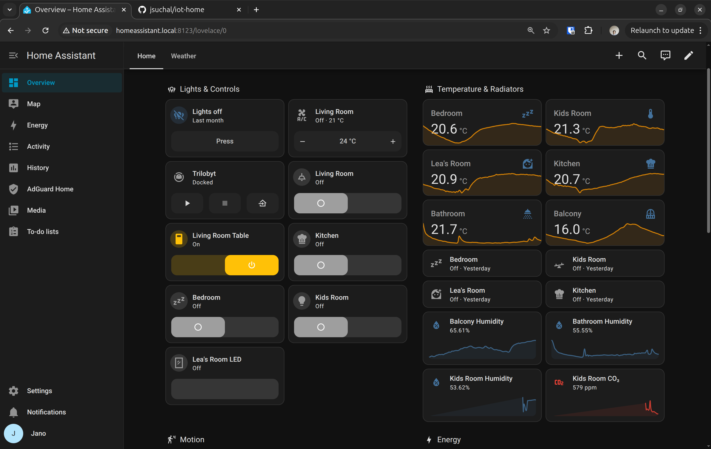
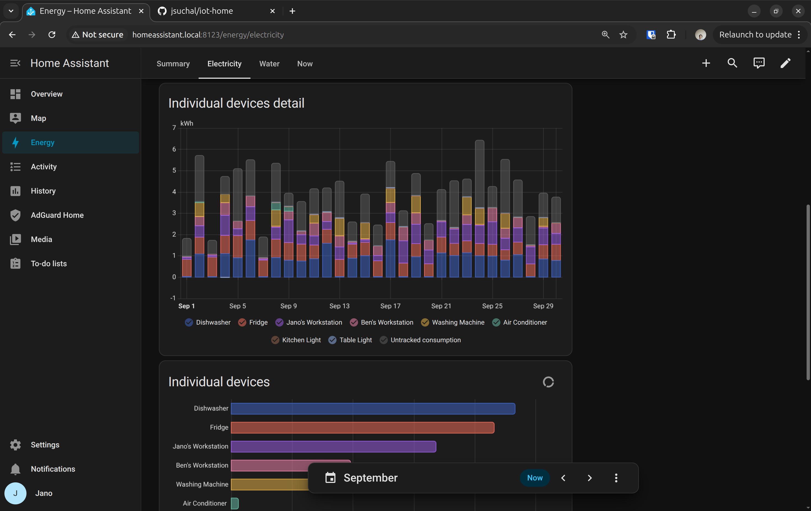
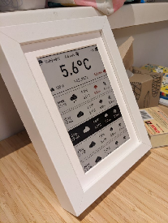

# IoT doma

# Čo toto vie?

- Meranie CO2 \- asi najdôležitejšie, čo chceš merať  
- Ovládanie svetiel \+ ovládanie zásuvky  
- Meranie spotreby energie \- dobré vedieť  
- Meranie teploty z pomerových meračov v byte na radiátoroch cez anténu  
- Meranie odberu vody cez anténu  
- Bezpečné pripojenie na diaľku cez internet  
- Blokovanie reklamy a “safe browsing” na filtrovanie cez DNS (pokým decká neprídu na to, ako meniť DNS)  
- “Zivy obraz” s predpovedou počasia \- e-ink \- [https\://x.com/jsuchal/status/1753131358975565989](https://x.com/jsuchal/status/1753131358975565989)

# Obrázky

## Home Assistant

Prehľad domácnosti:

Spotreba elektriny:

## Živý obraz

# HW

## Verzia 1.0

- Gosund EP2 smart plug 2x  
- LaskaKit upgrade na IKEA vindriktning meranie mikrocastic, co2, vlhkosti, teploty  
- Raspberry Pi 3 centrála (home assistant)  
- 2x merače teploty/vlhkosti flashnute na BTHome  
- Anténa na RTL-SDR   
- Shelly na meranie spotreby centrálne

## Verzia 1.1 \- “živý obraz”

- ESP32 \- [https\://www\.laskakit.cz/laskakit-espink-esp32-e-paper-pcb-antenna/?variantId=12416](https://www.laskakit.cz/laskakit-espink-esp32-e-paper-pcb-antenna/?variantId=12416)  
- E-ink 3 farby \- [https\://www\.aliexpress.com/item/1005003257813373.html?spm=a2g0o.order\_list.order\_list\_main.5.5ec7586ax5iCIc](https://www.aliexpress.com/item/1005003257813373.html?spm=a2g0o.order_list.order_list_main.5.5ec7586ax5iCIc)  
- Bateria \- [https\://www\.laskakit.cz/geb-lipol-baterie-805060-3000mah-3-7v-jst-ph-2-0/](https://www.laskakit.cz/geb-lipol-baterie-805060-3000mah-3-7v-jst-ph-2-0/)  
- Ram \- IKEA RIBBA \- uz sa nepradava asi

## Verzia 2.0

- Upgrade centrály, RPI3 to nedávalo, nestabilné, nahradené z bazosu za [https\://www\.umax.cz/umax-u-box-n41/](https://www.umax.cz/umax-u-box-n41/)  
- IKEA vindrikting som musel vypnut meranie tuhych castic (odpojil som, ostala vlastne len povodna krabicka) \- vetrak bol spinavy a hucal tak, ze to uz vadilo. Pevne castice aj tak namerali u nas nieco len raz za rok, cize ziadna strata.  
- Dostal som darovaný Home Assistant ZBT-1 zigbee dongle [https\://www\.home-assistant.io/connectzbt1/](https://www.home-assistant.io/connectzbt1/) \- gamechanger\!  
- 2x IKEA vypínače [https\://zigbee.blakadder.com/Ikea\_E1743.html](https://zigbee.blakadder.com/Ikea_E1743.html)  
- 2x IKEA žiarovky TRADFRI bulb E27 WW 806lm  
- 3x IKEA TRADFRI bulb GU10 WW 400lm  
- 1x IKEA TRADFRI control outlet \- v podsate nepotrebujem, ale sluzi ako repeater “v gauci”  
- 2x merače teploty flashnute z BTHome na Zigbee  
  - [https\://pvvx.github.io/ATC\_MiThermometer/TelinkMiFlasher.html](https://pvvx.github.io/ATC_MiThermometer/TelinkMiFlasher.html)

## Verzia 3.0 – ďalšie lokálne zariadenia

Inventár potvrdený podľa zariadení v Home Assistante; chýbajúce ceny ešte treba doplniť.

- 5× IKEA INSPELNING smart zásuvka (Zigbee/ZHA)
- 5× Aqara Light Switch H2 EU (2 Buttons, 1 Channel; WS-K07D, v HA `lumi.switch.agl009`; Zigbee/ZHA).
- 2× IKEA TRADFRI farebná žiarovka E27, 806 lm (Zigbee/ZHA)
- 1× IKEA ORMANÄS LED pás (Zigbee/ZHA)
- 1× IKEA PARASOLL senzor dverí/okna (Zigbee/ZHA)
- 1× IKEA BADRING senzor úniku vody (Zigbee/ZHA)
- 1× IKEA VALLHORN pohybový senzor (Zigbee/ZHA)
- 1× IKEA SOMRIG tlačidlo (Zigbee/ZHA)
- 2× IKEA STYRBAR (v HA Remote Control N2; Zigbee/ZHA)
- 1× Shelly 3EM-63T Gen3 na meranie spotreby elektriny (v HA Shelly 3EM-63 Gen3; lokálna integrácia Shelly); nahradil pôvodný Shelly EM.
- Umývačka Bosch SMV4EVX08E (zatiaľ Home Connect a závislosť od cloudu; lokálnu alternatívu treba vyskúšať).
- Klimatizácia Samsung WINDFREE 3,5 kW COMFORT S2 (zatiaľ SmartThings a závislosť od cloudu; lokálnu alternatívu treba vyskúšať).
- Robotický vysávač Roborock s [Valetudo](https://valetudo.cloud/) (lokálne cez MQTT, po rekonštrukcii bytu).
- 2× vodomer Techem MK Radio 4 (studená a teplá voda; vo wmbusmeters ovládač `mkradio4`): okrem šifrovaných vysielajú aj nešifrované údaje, ktoré HA číta cez W-MBus/MQTT.

Živý obraz pre e-ink displej zostáva v prevádzke. Lovelace Kindle Screensaver je v HA nainštalovaný, ale momentálne sa nepoužíva; hľadám lokálnu náhradu za Živý obraz.

Tailscale na prístup zvonku a Google Drive na zálohy zatiaľ zostávajú vedomými cloudovými výnimkami. Cieľom je, aby domáce ovládanie fungovalo lokálne aj bez internetu; vzdialený prístup a záloha mimo domácnosti môžu vyžadovať externú infraštruktúru.

# Software

- [Lokálny e-ink endpoint pre Home Assistant](eink-ha/README.md) – add-on alebo samostatný server kompatibilný s pôvodným firmware Živého obrazu; pripravené na testovanie na displeji.

- [https\://www\.home-assistant.io/](https://www.home-assistant.io/)  
  - Addons  
    - Prístup z inetu \- [https\://tailscale.com/](https://tailscale.com/) (zadarmo), netreba nikde otvarat porty \+ ma addon do HA  
    - [https\://github.com/wmbusmeters/wmbusmeters-ha-addon](https://github.com/wmbusmeters/wmbusmeters-ha-addon) \- čítanie rádiových signálov z pomerových meračov tepla a vodomerov Techem v paneláku
      - Potrebuje [https\://www\.home-assistant.io/integrations/mqtt](https://www.home-assistant.io/integrations/mqtt)  
    - ZHA \- [https\://www\.home-assistant.io/integrations/zha/](https://www.home-assistant.io/integrations/zha/)  
    - [https\://github.com/hassio-addons/addon-ssh](https://github.com/hassio-addons/addon-ssh)  
- [https\://zivyobraz.eu/](https://zivyobraz.eu/) \- aj firmware od nich  
- ESPHome na laskakit creva IKEA vindrikning  
  - Zdrojaky [https\://github.com/jsuchal/iot-home](https://github.com/jsuchal/iot-home)
- [Valetudo](https://valetudo.cloud/) – lokálne ovládanie robotického vysávača Roborock cez MQTT.

# TODOs

- Verzia 3.0 – lokálna prevádzka bez závislosti od cloudu (po inventúre v HA):
  - [x] Overiť odčítanie vodomerov Techem: nešifrované údaje sú dostupné a fungujú v HA bez získavania šifrovacieho kľúča.
  - [x] Spísať zariadenia a integrácie z HA; rozlíšiť lokálne zariadenia a známe cloudové výnimky.
  - [ ] Bosch SMV4EVX08E: vyskúšať [Home Connect Local](https://github.com/chris-mc1/homeconnect_local_hass) namiesto cloudovej integrácie Home Connect. Kompatibilita a funkcie na tomto modeli ešte nie sú overené; na prvotné nastavenie integrácia vyžaduje Home Connect účet a stiahnutie profilu so šifrovacím kľúčom. Otestovať prevádzku bez internetu až po nastavení.
  - [ ] Samsung WINDFREE 3,5 kW COMFORT S2: overiť kompatibilitu s [ESPHome Samsung HVAC Bus](https://docs.samsung-hvac.aran.net.tr/wiki/), potom kúpiť potrebný HW (napr. ESP32 a RS-485 adaptér, až po overení zbernice) a zapojiť/otestovať lokálne ovládanie namiesto SmartThings. Zatiaľ nič nie je nainštalované.
  - [x] Roborock s [Valetudo](https://valetudo.cloud/) ovládať lokálne cez MQTT (po rekonštrukcii bytu).
  - [x] Lokálne alternatívy pre väčšinu zariadení sú nasadené; otvorené výnimky Bosch a Samsung sú uvedené vyššie.
  - [ ] Nájsť a otestovať lokálnu náhradu za Živý obraz na e-ink displeji (napr. ESPHome + lokálny dashboard/generovanie obrázka). Živý obraz zatiaľ zostáva; Lovelace Kindle Screensaver je nainštalovaný, ale nepoužíva sa.
  - [ ] Preskúmať alternatívu ku Google Drive zálohám bez straty zálohy mimo domácnosti; pridať obnoviteľnú lokálnu zálohu a otestovať obnovu. Google Drive zatiaľ ponechať.
  - [ ] Doplniť samostatné meranie spotreby elektriny varnej dosky v HA: doska je zapojená na dve fázy, preveriť použitie ďalšieho Shelly 3EM-63T Gen3 a miesto v rozvádzači.
- Zálohovanie  
  - ~~ESPhome zdrojáky na github~~  
- Security  
  - Sieť   
    - separé AP z RPI3?  
    - Vlan? Iot jail  
    - Kewo?  
- Lokálny e-ink displej namiesto [Živého obrazu](https://zivyobraz.eu/) – pozri TODO verzie 3.0 vyššie.

## Kúpiť

- ~~Krátky ethernet kábel \- na centrálu~~  
- ~~Shelly EM~~  
- ~~Anténu / mbus stick na merače tepla/vody~~  
- ~~IKEA senzor na dvere [https\://www\.ikea.com/sk/sk/p/parasoll-senzor-na-dvere-okno-inteligentne-biela-80504308/](https://www.ikea.com/sk/sk/p/parasoll-senzor-na-dvere-okno-inteligentne-biela-80504308/)~~
- ~~2× IKEA farebné žiarovky~~ (verzia 3.0; podľa HA sú to E27, nie pôvodne plánované E14)

## Done

- Centrála  
  - ~~RPI3 inštalácia~~  
  - ~~Adblocker~~  
    - ~~AdGuard~~  
- Meranie vody  
  - ~~Zavolat 19.9. technikovi techemu, ze ako s klucom, na SK to nevedia, pisal som na DE centralu. Nakoniec aj nešifrované.~~  
  - ~~Chcelo by to specku, zjavne nevedia ani wmbusmeters parsovat celý telegram~~   
- ~~Meranie tepla~~  
  - ~~Funguje\! Nešifrované\!~~  
- Meranie spotreby elektriny  
  - ~~Shelly EM (nay vyrazne lacnejsi ako alza \- aj svorka [https\://www\.nay.sk/shelly-em-1-50a-wifi-monitor-spotreby](https://www.nay.sk/shelly-em-1-50a-wifi-monitor-spotreby))~~  
  - ~~Gosund ep2~~  
    - ~~Nejako nakalibrovať~~  
    - BRICKED  
  - ~~Odmerat~~  
    - ~~Umyvacku~~  
    - ~~Chladnicku \- wifi nedociahne?~~  
    - ~~Pracku~~  
- Merač kvality vzduchu  
  - Teplota a vlhkosť je mimo, ohrieva sa to vnútri v krabičke. Vytiahnuť senzor von?  
    - Test so senzorom vonku. Kalibracia?  
    - Skusit ho dat dalej od dosky  
  - ~~XIAOMI Mijia Bluetooth Thermometer \- bluetooth~~  
    - ~~Custom firmware [https\://github.com/pvvx/ATC\_MiThermometer](https://github.com/pvvx/ATC_MiThermometer)~~  
- ~~Komunikacia so zigbee (napr ziarovky…)~~  
  - [~~https\://www\.home-assistant.io/integrations/zha~~](https://www.home-assistant.io/integrations/zha)  
    - ~~Oficialny HW od HA [https\://www\.home-assistant.io/skyconnect/](https://www.home-assistant.io/skyconnect/)~~

- Zálohovanie  
  - ~~Backup rpi3 na s3/google~~  
    - [~~https\://community.home-assistant.io/t/add-on-home-assistant-google-drive-backup/107928~~](https://community.home-assistant.io/t/add-on-home-assistant-google-drive-backup/107928)  
  - ~~Nativne HA~~  
- ~~Kindle ako eink display~~   
  - [~~https\://community.home-assistant.io/t/kindle-e-ink-home-info-display/378002~~](https://community.home-assistant.io/t/kindle-e-ink-home-info-display/378002) ~~(pekny dizajn)~~  
- Refactor  
  - ~~Lepší manažment secrets v ESPHome~~ \+ zdrojáky na github  
- Dokumentácia  
- ~~Automatizácia~~  
  - ~~Korytnačka Agáta notifikácie podľa počasia~~  
- ~~Inštalácia home companion app na mobil~~  
- Best practices pre automation/zasuvky/meranie/vselico?

# Tipy

- Aqara Light Switch H2 EU (2 Buttons, 1 Channel) má okrem ovládania relé aj programovateľné druhé tlačidlo a dlhé podržanie. V Home Assistante cez ZHA sa tieto akcie dajú použiť ako spúšťače automatizácií: napríklad druhým tlačidlom rozsvietiť svetlo inde v byte alebo dlhým stlačením zmeniť farbu žiarovky. Automatizácie vyžadujú bežiaci HA.
- Tip na vodomery: pripojiť USB SDR prijímač, porovnať zachytené telegramy s údajmi na vlastných vodomeroch a nechať si pomôcť s identifikáciou a vizualizáciou dát. V telegramoch sa môžu skrývať aj historické odpočty. [Ako som to skúšal s pomocou AI](https://x.com/jsuchal/status/2103961888686047471).

# Gotchas

- Pre programovateľné akcie Aqara H2 bolo potrebné pridať vlastný ZHA quirk; postup a skúsenosť s fungovaním sú v [diskusii k PR #4141](https://github.com/zigpy/zha-device-handlers/pull/4141#issuecomment-4320272080). Bez quirku nemusia byť akcie druhého tlačidla a dlhého stlačenia v HA dostupné.
- ESPHome po restarte smart plug bol nastaveny, ze sa vypne, prehodil som firmware na to aby sa zapol vzdy (nevypinal umyvacku). Pre agatu zase vhodny restore na predchadzajuci stav a default off.  
- Vodomery Techem MK Radio 4 (`mkradio4`) reportujú stav raz denne, v prírastkoch po 0,1 m³ (100 litrov). Na sledovanie priebežnej drobnej spotreby sa preto nehodia; zmysel má skôr týždenná alebo mesačná spotreba.
- Vodomery Techem vysielajú aj nešifrované údaje. Šifrované telegramy stále môžu existovať, ale na funkčné odčítanie v HA netreba získavať kľúč.
- Ziarovky na dialkove ovladanie su super, ale pokial mate “fyzicke” vypinace na stene, tak po vypnuti je smart ovladanie logicky mrtve :) \- treba riesit cez smart vypinace \= rozbabrat elektriku  
- Zigbee je super (mesh), ale kedze sa viaze na centralu (u mna HA), tak pokial sa vypne centrala, tak si nikto nezasvieti doma (naproti priamemu parovaniu ziarovka \- ovladac).  
  - Toto sa da fixnut tak, ze sa vytvoria clusters a direct binding cez ZHA nastavit priamo.  
  - Ak nahodou nereflektuje status cluster v HA UI tak https\://community.home-assistant.io/t/zha-light-status-not-updated-after-power-on-or-off-using-a-light-switch/169967/9  
- Automatizacia na HA tak, aby dlhe potlacenie tradfri ovladaca zvysilo/znizilo jas sa ukazalo ako neprekonatelny problem. Pritom pri nativnom “peer-to-peer” parovani funguje vyborne.

# Rozpočet

| Prístroj | Položka | Množstvo | Celková cena (€) |
| :---- | :---- | :---- | ----: |
| **Verzia 1.0** |  |  |  |
| Meranie a ovládanie spotreby elektriny | Gosund EP2 smart plug [https\://www\.alza.sk/gosund-wifi-smart-plug-ep2-2-pack-d6733245.htm](https://www.alza.sk/gosund-wifi-smart-plug-ep2-2-pack-d6733245.htm) (bola akcia za 21e) | 2ks | 21 |
| Meranie celkovej spotreby elektriny | [https\://www\.conrad.sk/p/shelly-em-spinacia-a-meracie-aktor-wi-fi-2246359](https://www.conrad.sk/p/shelly-em-spinacia-a-meracie-aktor-wi-fi-2246359) [https\://www\.conrad.sk/p/shelly-20212-rozsirovaci-modul-2246358](https://www.conrad.sk/p/shelly-20212-rozsirovaci-modul-2246358) | 1ks \+ 1ks | 65 |
| Meranie kvality vzduchu | [https\://www\.ikea.com/sk/sk/p/vindriktning-snimac-kvality-vzduchu-80515910/](https://www.ikea.com/sk/sk/p/vindriktning-snimac-kvality-vzduchu-80515910/) | 1ks | 12 |
|  | [https\://www\.laskakit.cz/laskakit-esp-vindriktning-esp-32-i2c/](https://www.laskakit.cz/laskakit-esp-vindriktning-esp-32-i2c/) | 1ks | 21 |
|  | [https\://www\.laskakit.cz/laskakit-scd41-senzor-co2--teploty-a-vlhkosti-vzduchu/](https://www.laskakit.cz/laskakit-scd41-senzor-co2--teploty-a-vlhkosti-vzduchu/) | 1ks | 53 |
|  | USB-C / USB-A kábel 1m[https\://www\.alza.sk/alzapower-core-charge-20-usb-c-1-m-cierny-d5871664.htm](https://www.alza.sk/alzapower-core-charge-20-usb-c-1-m-cierny-d5871664.htm)  | 1ks | 4 |
|  | USB-A adaptér *(mal som doma)* |  | \- |
| Meranie teploty a vlhkosti | XIAOMI Mijia Thermometer 2 Bluetooth-compatible[https\://www\.aliexpress.com/item/1005002895208970.html](https://www.aliexpress.com/item/1005002895208970.html) (deal za prvy nakup vlastne zadarmo, inak to stoji tak 5.5 eur kus) | 1ks | 0.5 |
| Centrála | Raspberry PI 3 (na bazoši, s krabičkou a adaptérom, bez pamäte) | 1ks | 53 |
|  | Pamäťová karta 32gb (micro SDHC, U1, UHS-1) *(mal som doma)* | 1ks | \- |
|  | Krátky ethernet kábel *(kamoš mal nepouživaný)* |  | \- |
| Skener senzorov / radio-tv prijimac | [https\://www\.banggood.com/sk/Mini-USB-FM-Radio-DVB-T-RTL2832-+-FC0012-SDR-Digital-Receiver-Stick-with-Remote-Control-p-1942404.html](https://www.banggood.com/sk/Mini-USB-FM-Radio-DVB-T-RTL2832-+-FC0012-SDR-Digital-Receiver-Stick-with-Remote-Control-p-1942404.html) (fajn deal zadarmo k tomu aj 128 gb microsd karta za \- 1\. nakup) | 1ks  | 18.5 |
| **Verzia 2.0** |  |  |  |
| Centrála | UMAX U-BOX N41 (deal na bazosi, pasivne chladenie, SSD, dostatok USB portov)[https\://www\.umax.cz/umax-u-box-n41/](https://www.umax.cz/umax-u-box-n41/) | 1ks | 103 |
| ZigBee dongle | [https\://www\.home-assistant.io/connectzbt1/](https://www.home-assistant.io/connectzbt1/) (dar od kamosa) | 1ks | \- |
| **Verzia 3.0** |  |  |  |
| Inteligentné zásuvky | IKEA INSPELNING | 5 ks | 49,95 |
| Vypínače | Aqara Light Switch H2 EU, WS-K07D | 5 ks | 188,95 |
| Farebné žiarovky | IKEA TRÅDFRI E27 806 lm | 2 ks | 26,70 |
| LED pásik | IKEA ORMANÄS 4 m | 1 ks | 25,65 |
| Senzor dverí/okna | IKEA PARASOLL | 1 ks | 8,19 |
| Senzor úniku vody | IKEA BADRING | 1 ks | 8,19 |
| Pohybový senzor | IKEA VALLHORN | 1 ks | 8,19 |
| Tlačidlo | IKEA SOMRIG | 1 ks | 5,10 |
| Diaľkové ovládače | IKEA STYRBAR | 2 ks | 20,50 |
| Meranie elektriny | Shelly 3EM-63T Gen3 | 1 ks | 77,19 |

# Prílohy

## Gosund EP2 \+ ESPHome

1. Rozbaliť zapojiť a normálne nainštalovať originál appku a oživiť tam smart zásuvku. V menu (v detailoch) následne nájdete virtualID zariadenia.  
2. Napísať email na generický [globalservice@gosund.com](mailto:globalservice@gosund.com) s textom:   
   *Hi,*

   *I would like to use gosund smart power sockets with tuya-convert and that probably needs firmware update to v1.0.6 virtual ids are … and my gosund account email is …*

   *Could you make this happen?*

3. Po 2-3 pracnovných dňoch sa v appke zobrazí možnosť upgrade na nový firmware v1.0.6  
4. Nainštalovať [https\://github.com/ct-Open-Source/tuya-convert\#installation](https://github.com/ct-Open-Source/tuya-convert#installation) a ísť presne podľa pokynov.  
5. Reset zariadenia sa robí 5-6x stlačením tlačítka, počas flashovania nemajte nič zapojené do zásuvky, treba ísť naozaj PRESNE podľa pokynov. Sem-tam sťahovanie backup firmware spadne, treba to zabiť a pustiť znova až kým to nezbehne rýchlo.  
6. Ja som flashol na tasmota.bin, pripojil sa na AP zásuvky, nastavil wi-fi a potom cez tasmota web portál spravil OTA upload nového ESPHome firmware. Ak do tuya-convert nahráte do files nový firmware, tak to asi ide aj napriamo, bez tohto cirkusu.  
7. Konfigurák pre gosund ep2 sa dá nájsť na [https\://github.com/arendst/Tasmota/discussions/10350\#discussioncomment-2989313](https://github.com/arendst/Tasmota/discussions/10350#discussioncomment-2989313) wifi sekciu som upravil na   
   wifi:  
     ssid: \!secret wifi\_ssid  
     password: \!secret wifi\_password

   \# Enable fallback hotspot (captive portal) in case wifi connection fails  
     ap:  
       ssid: "\${plug\_name} Fallback Hotspot"  
       password: "nbusr123"  
8. Po uploade nového firmware (odporúčam upload spakovaný gzip, keď to hlási málo miesta) Home Assistant normálne detekuje nové zariadenie, zadáte API key a hotovo.
